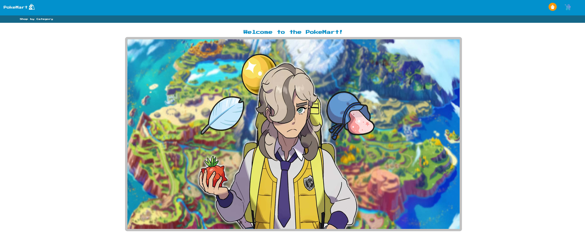
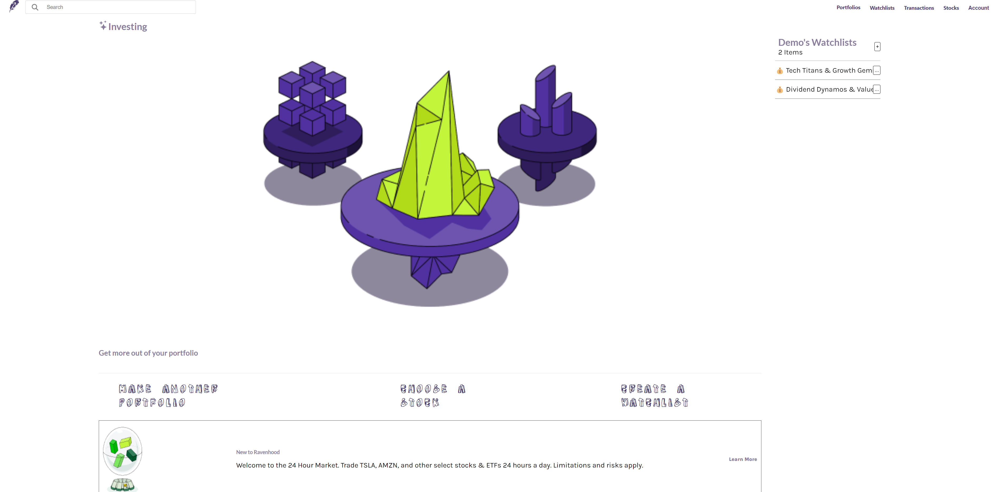

					

						<!-- Tweets -->
						<section class="col-4 col-12-mobile">
							<header>
								<h2 class="icon brands fa-twitter circled">Tweets</h2>
							</header>
							<ul class="divided">
								<li>
									<article class="tweet">
										Amet nullam fringilla nibh nulla convallis tique ante sociis accumsan.
										5 minutes ago
									</article>
								</li>
								<li>
									<article class="tweet">
										Hendrerit rutrum quisque.
										30 minutes ago
									</article>
								</li>
								<li>
									<article class="tweet">
										Curabitur donec nulla massa laoreet nibh. Lorem praesent montes.
										3 hours ago
									</article>
								</li>
								<li>
									<article class="tweet">
										Lacus natoque cras rhoncus curae dignissim ultricies. Convallis orci aliquet.
										5 hours ago
									</article>
								</li>
							</ul>
						</section>

						<!-- Posts -->
						<section class="col-4 col-12-mobile">
							<header>
								<h2 class="icon solid fa-file circled">Posts</h2>
							</header>
							<ul class="divided">
								<li>
									<article class="post stub">
										<header>
											<h3><a href="#">Nisl fermentum integer</a></h3>
										</header>
										3 hours ago
									</article>
								</li>
								<li>
									<article class="post stub">
										<header>
											<h3><a href="#">Phasellus portitor lorem</a></h3>
										</header>
										6 hours ago
									</article>
								</li>
								<li>
									<article class="post stub">
										<header>
											<h3><a href="#">Magna tempus consequat</a></h3>
										</header>
										Yesterday
									</article>
								</li>
								<li>
									<article class="post stub">
										<header>
											<h3><a href="#">Feugiat lorem ipsum</a></h3>
										</header>
										2 days ago
									</article>
								</li>
							</ul>
						</section>

						<!-- Photos -->
						<section class="col-4 col-12-mobile">
							<header>
								<h2 class="icon solid fa-camera circled">Photos</h2>
							</header>
							

								

									
								

								

									
								

								

									
								

								

									
								

								

									
								

								

									
								

							

						</section>

					

					

				<article id="main" class="container special">
					
					<header>
						<h2><a href="#">A Little About Myself</a></h2>
						<!-- 

							Sociis aenean eu aenean mollis mollis facilisis primis ornare penatibus aenean. Cursus ac
							enim
							pulvinar curabitur morbi convallis. Lectus malesuada sed fermentum dolore amet.
						
 -->
					</header>
					

					

						<article class="col-4 col-12-mobile special">
							
							<header>
								<h3><a>Pokestore</a></h3>
							</header>
							

								Pokestore is a financial web application inspired from Amazon, that displays over 300
								purchasable items using the PokeAPI library. The application allows users to make
								purchases, create, read, update and delete reviews and lists, and update orders.
							

						</article>

						<article class="col-4 col-12-mobile special">
							
							<header>
								<h3><a href="https://ravenhood-project.onrender.com/">Ravenhood</a></h3>
							</header>
							

								Ravenhood is a financial application inspired from Robinhood that displays over 500
								stocks and provides real
								information about a company. The application allows users to create, read, update and
								delete portfolios as well as make transactions in the form of buys and sells.
							

							<ul class="icons">
								<li><a href="https://github.com/bayodelaoye/ravenhood"
										class="icon brands fa-github">Github</a>
								</li>
							</ul>
						</article>

						<!-- <article class="col-4 col-12-mobile special">
								
								<header>
									<h3><a href="#">Magna laoreet et aliquam</a></h3>
								</header>
								

									Amet nullam fringilla nibh nulla convallis tique ante proin sociis accumsan lobortis.
									Auctor etiam
									porttitor phasellus tempus cubilia ultrices tempor sagittis. Nisl fermentum consequat
									integer interdum.
								

							</article> -->
					

					

					<footer>
						<a href="#" class="button">Continue Reading</a>
					</footer>
				</article>

			

